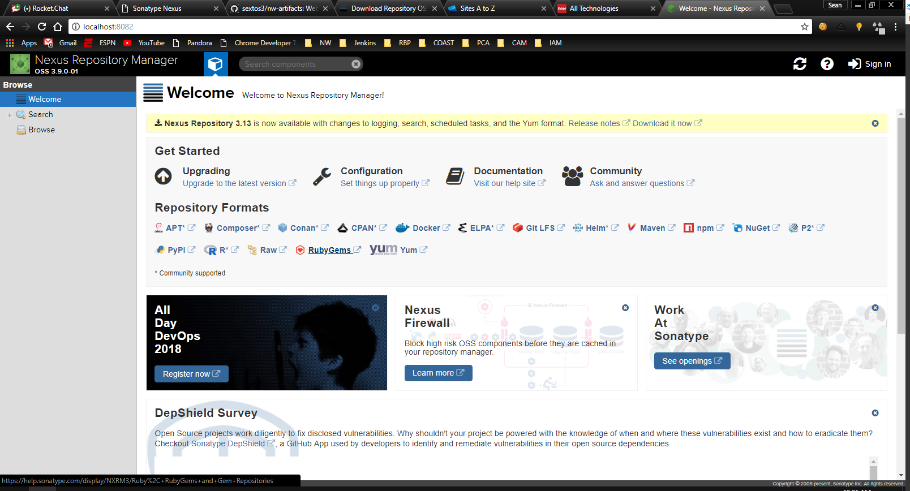
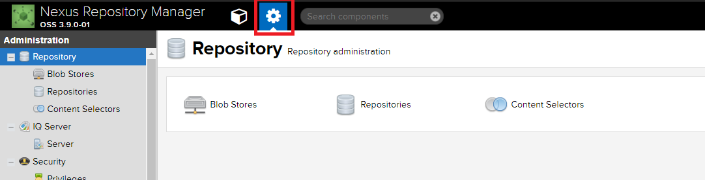
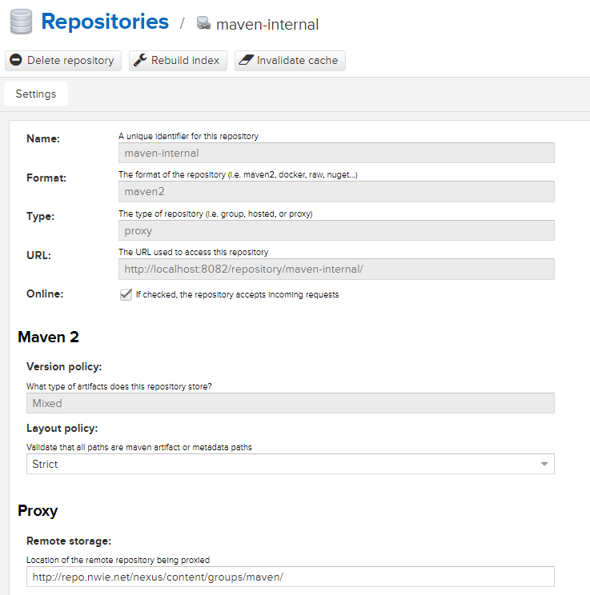
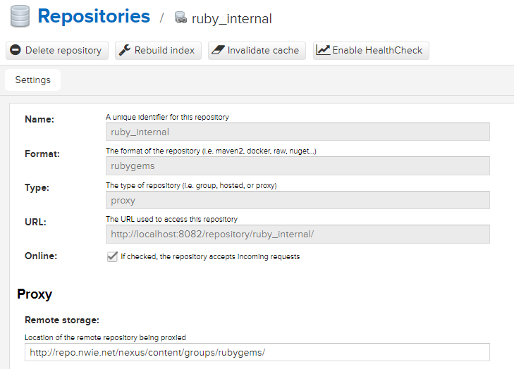
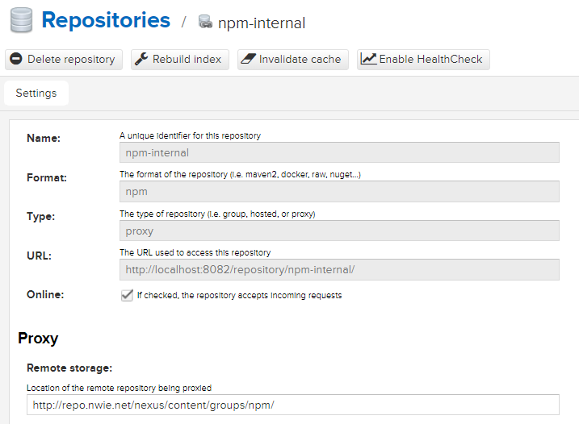

# Nexus - Creating a local mirror #

- [Nexus - Creating a local mirror](#nexus---creating-a-local-mirror)
  - [Nexus installation and setup](#nexus-installation-and-setup)
  - [Mirroring Central Nexus](#mirroring-central-nexus)
    - [Maven Mirror](#maven-mirror)
    - [Ruby Mirror](#ruby-mirror)
    - [Npm Mirror](#npm-mirror)
  - [Using the local Nexus mirrors](#using-the-local-nexus-mirrors)
    - [Using the Maven mirror](#using-the-maven-mirror)
    - [Using the Ruby mirror](#using-the-ruby-mirror)
    - [Using the Npm mirror](#using-the-npm-mirror)

## Nexus installation and setup ##

Creating a local mirror of the central Nexus repo can be a great mitigation strategy for situations when the Nationwide central repo has outages. This can be accomplished through the following steps:

1. Install [Nexus].(https://www.sonatype.com/download-oss-sonatype)
2. The installer will create a Windows service that controls whether Nexus is running. Before starting it, it may be helpful to update the port that Nexus runs on. Simply edit the `etc/nexus-default.properties` file and change the value of `application-port=<desiredPortNumber>`.
3. Start the Nexus Windows service (search for services.msc, find `nexus`, right click `start service`). If it's already started, just choose `restart service` instead.
4. Verify Nexus is running at `http://localhost:<portNumberFromStep2>`:



## Mirroring Central Nexus ##

Now that Nexus is setup, it's time to configure it. Below are setup steps for Maven, Ruby, and Npm. Note that steps are repeated between the different repos, so reference the Maven steps where applicable.

### Maven Mirror ###

1. Login to the local Nexus instance (default user is admin/admin123).
2. Click the gear icon from the top menu navigation.



3. Click `repositories` from the left menu navigation or the central content section.


4. Click `create repository` in the central content section.
5. Click `maven2 (proxy)`
6. Configure the mirror as reflected in the screenshot below. 

**Note: For anything not shown, use the default values. Make sure to change the version policy to mixed, as central Nexus holds both snapshot and release versions of artifacts, and the mirror will not work without this change. The repo name can be any value, just make note of the value used since it will be needed later.**



### Ruby Mirror ###

1. Repeat [steps 1-5](#maven-mirror) from the Maven setup. If all goes right, the `Repositories - Select Recipe` page will be displayed.
2. Click `rubygems (proxy)`
3. Configure the mirror as reflected in the screenshot below.

**Note: As with Maven, the name of the repo does not matter. Just make note of the value used since it will be needed later.**



### Npm Mirror ###

1. Repeat [steps 1-5](#maven-mirror) from the Maven setup. If all goes right, the `Repositories - Select Recipe` page will be displayed.
2. Click `npm (proxy)`
3. Configure the mirror as reflected in the screenshot below.

**Note: As with Maven, the name of the repo does not matter. Just make note of the value used since it will be needed later.**



## Using the local Nexus mirrors ##

As with setting up the mirrors, using each one requires slightly different setup. See below for details around each dependency management framework.

### Using the Maven mirror ###

All edits in this section will refer to changing Maven's `settings.xml` file. As with any other change, this can be added to the global config file or the user config file, though it's always recommended to change the user config over the global config.

1. Add the following XML block as a child element of settings->profiles->profile->repositories:

```xml
<repository>
  <id>local-internal</id>
  <name>local-internal</name>
  <url>http://localhost:[portNumberFromNexusConfig]/repository/[mavenMirrorRepoName]/</url>
  <releases>
    <enabled>true</enabled>
    <checksumPolicy>warn</checksumPolicy>
    <updatePolicy>always</updatePolicy>
  </releases>
  <snapshots>
    <enabled>true</enabled>
    <updatePolicy>always</updatePolicy>
  </snapshots>
</repository>
```

**Note: The url is dependent on both the port used in configuring Nexus and the repository name chosen during the setup of the mirror.**

2. Add the following XML block as a child element of setting->mirrors:

```xml
<mirror>
  <id>local-mirror</id>
  <mirrorOf>*,!localhost,!scottsdale-nexus</mirrorOf>
  <name>Local mirror</name>
  <url>http://localhost:[portNumberFromNexusConfig]/repository/[mavenMirrorRepoName]/</url>
</mirror>
```

Eclipse (or any other IDE) might need to be restarted for changes to take effect. The local maven repository (${user.home}/.m2/repository) will need to be deleted to force Maven and Nexus to download artifacts, as Maven prefers to use its local cache before downloading anything. After these steps, the next time a Maven build is performed, the logs should reflect contacting the localhost Maven repo mirror when downloading artifacts, which will populate the local Nexus cache.

### Using the Ruby mirror ###

This assumes that Ruby's bundler is being used to manage gem dependencies. All edits in this section will be to Ruby's bundle config file. As with Maven, these edits can be made to the global config file or the user config file, though it's always recommended to change the user config over the global config.

1. Add the following to the bundle config:

```ruby
BUNDLE_MIRROR__HTTP://REPO__NWIE__NET/NEXUS/CONTENT/GROUPS/RUBYGEMS/: "http://localhost:<portNumberFromNexusConfig>/repository/<rubygemsMirrorRepoName>/"
BUNDLE_SET: "--global mirror.http://repo.nwie.net/nexus/content/groups/rubygems/ http://localhost:<portNumberFromNexusConfig>/repository/<rubygemsMirrorRepoName>/"
```

This is actually telling bundler that the mirror for repo.nwie.net (Central Nexus) is the local Nexus instance setup in this doc. This approach was used to avoid the need to update any source declarations in project gemfiles, since this would break the ability for other users to build Ruby projects. 

RubyMine (or any other IDE) might need to be restarted for changes to take effect. The next time a bundle is updated, the logs should reflect contacting the localhost Ruby repo mirror when downloading artifacts, which will populate the local Nexus cache.

### Using the Npm mirror ###

All edits in this section will be to the Npm's `.npmrc` file. As with Maven, these edits can be made to the global config file or the user config file, though it's always recommended to change the user config over the global config.

1. Set the registry value as follows:

```javascript
registry=http://localhost:<portNumberFromNexusConfig>/repository/<npmMirrorRepoName>/
```

The next time an `npm install` is run, the logs should reflect contacting the localhost Npm repo mirror when downloading artifacts, which will populate the local Nexus cache.
