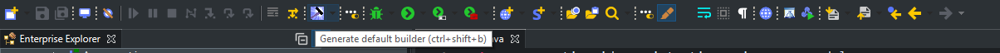
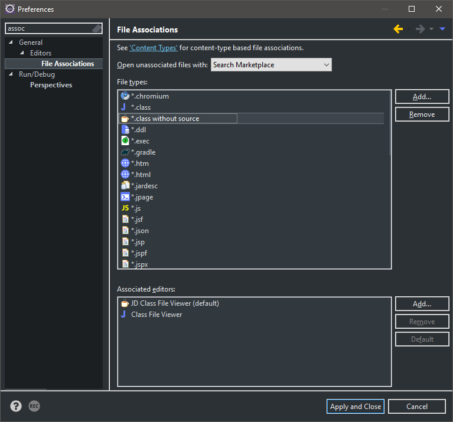
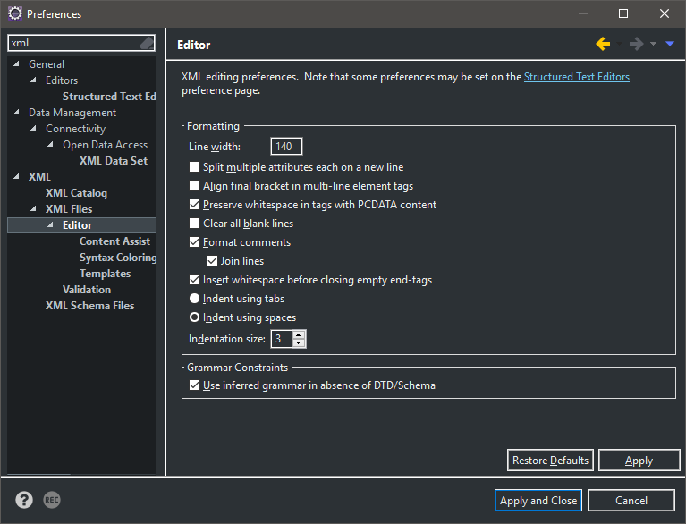
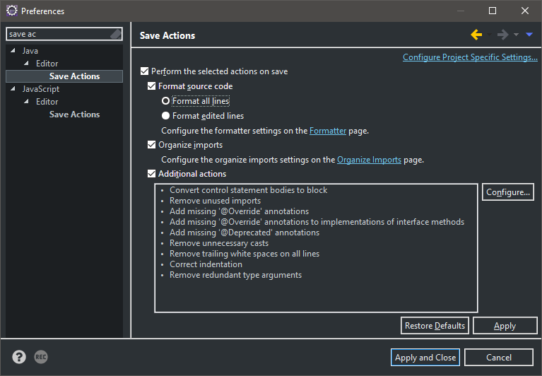
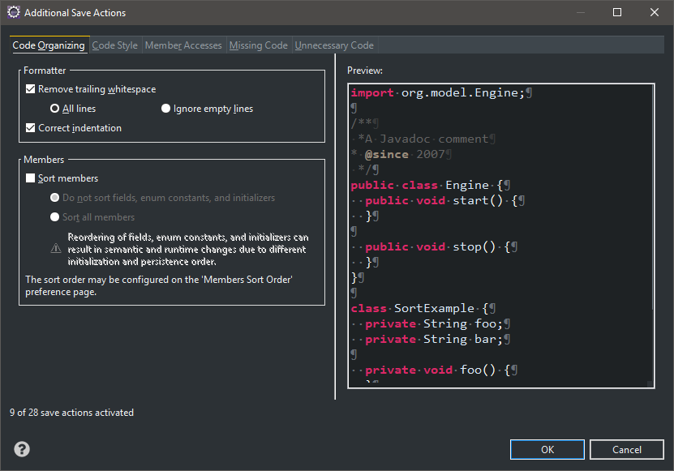
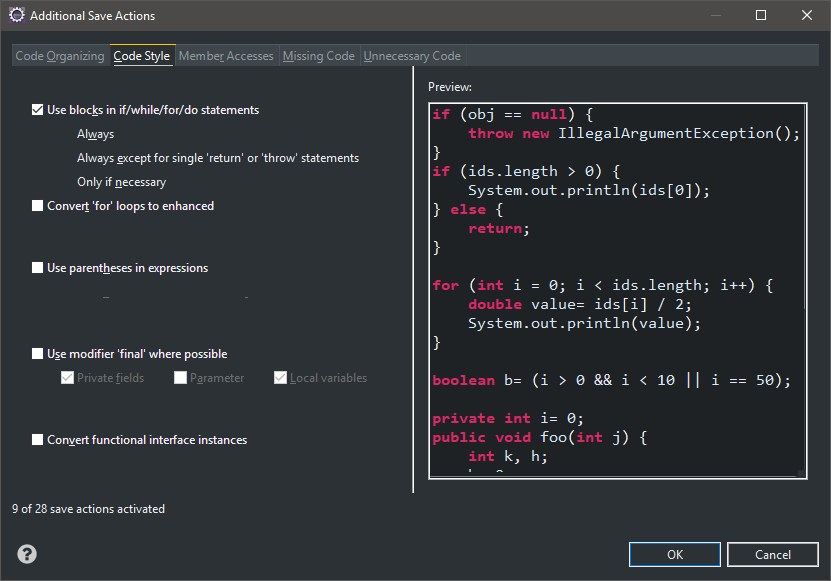
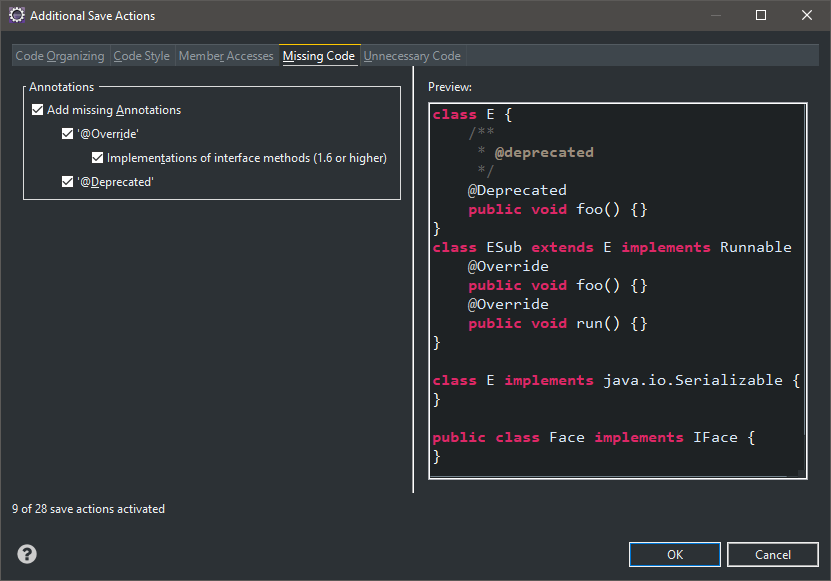
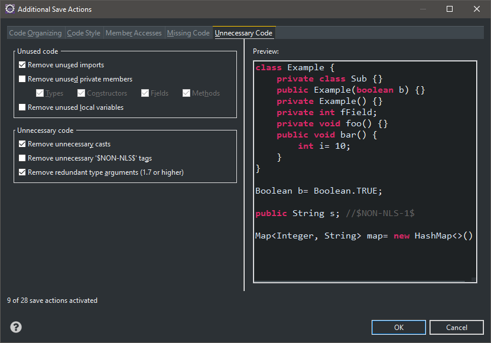

## Workspace Setup

- [Workspace Setup](#workspace-setup)
- [Java Setup](#java-setup)
- [Eclipse Setup](#eclipse-setup)
- [Eclipse Plugins](#eclipse-plugins)
- [Eclipse Configuration](#eclipse-configuration)
- [Eclipse Websphere Deploy Issues](#eclipse-websphere-deploy-issues)
- [IBM Installation Manager](#ibm-installation-manager)

## Java Setup

1.  Download and install [JDK 1.8](http://www.oracle.com/technetwork/java/javase/downloads/jdk8-downloads-2133151.html). This will needed by Eclipse to properly run the SonarLint plugin.
1.  Either set JAVA_HOME to this location of this JDK, or add `-vm <javaw.exe location>`\* to the eclipse.ini file. Do not quote the path if it has spaces, just ensure it's on a line by itself. It should be placed BEFORE the -vmargs line. For example:

```
-vm
C:\Program Files\Java\jdk1.8.0_172\bin\javaw.exe
```

**\*Note: this will be required for projects that still use JIBX < 1.3.1, as JAVA_HOME needs to be a 1.7 JDK to build older versions of JIBX.**

## Eclipse Setup

1.  Download and install [Eclipse Oxygen](https://www.eclipse.org/downloads/download.php?file=/technology/epp/downloads/release/oxygen/3a/eclipse-jee-oxygen-3a-win32-x86_64.zip&mirror_id=492).
2.  Once installed, launch it and setup proxy settings under Window->Preferences->search "proxy" to point to your local Cntlm or Nationwide's http-proxy. DO NOT SET THE PROXY FOR SOCKS, IT WILL CAUSE [ISSUES](https://stackoverflow.com/questions/5857499/how-do-i-have-to-configure-the-proxy-settings-so-eclipse-can-download-new-plugin).

## Eclipse Plugins

* Install the following plugins by downloading the zip file from these provided links and add it as an archive repo in Eclipse->Help->Install new software->Add...->Archive...
     * [SonarLint](https://github.com/SonarSource/sonarlint-eclipse/releases) - Click the Tags tab, then download the latest version's zip.
     * [Websphere](https://developer.ibm.com/wasdev/downloads/#asset/tools-IBM_Liberty_Developer_Tools_for_Eclipse_Oxygen) - Click the Download button next to "WebSphere Developer Tools for WebSphere® Application Server Liberty and WebSphere® Application Server traditional"

* Optional: Install the following plugins from the Eclipse Marketplace: [Spotbugs](https://marketplace.eclipse.org/content/spotbugs-eclipse-plugin) (formerly Findbugs) and [Spark Builder Generator](https://marketplace.eclipse.org/content/spark-builder-generator)
  * Spark Builder Generator is a tool that will convert POJOs to use the builder pattern by clicking the builder icon from the Eclipse toolbar. This allows for the following syntax when creating objects: ```object.builder().withFieldA("fieldA").withFieldB("fieldB").build()```. This results in a bit more readable code when creating objects (instead of unwieldy constructors or lines and lines of setters).
  
  

**Note: If you have issues connecting to the Eclipse Marketplace, try adding the following lines to your eclipse.ini file:**

```
-Dorg.eclipse.ecf.provider.filetransfer.excludeContributors=org.eclipse.ecf.provider.filetransfer.httpclient4
-Dorg.eclipse.ecf.provider.filetransfer.retrieve.closeTimeout=30000
-Dorg.eclipse.ecf.provider.filetransfer.retrieve.readTimeout=30000
```

* Optional: Install [JD-Eclipse](http://jd.benow.ca/). You will need to download the release zip and add it as an archive repo in Eclipse->Help->Install new software->Add...->Archive...
  * This is a tool for decompiling code when source isn't available in Maven. In Window->Preferences, search for "assoc" and select General->Editors->File Associations. Set JD Class Viewer as the default editor:



## Eclipse Configuration

* Import the [compiler settings](https://github.nwie.net/Nationwide/EDS-Apps/blob/master/workspace-setup/eclipsePrefs.epf): File->Import...->General->Preferences->select the preferences file from the download link.

**Note: Most of the settings above are from the [Sonar dev-tools repo](https://github.com/SonarSource/sonar-developer-toolset).**

* Setup the XML formatter: Window->Preferences->search "xml"->select XML->XML Files->Editor->follow the screenshot below:



* Optional: setup save actions:
  * In Windows->Preferences, search for "save" and select Java->Editor->Save Actions...

  

  * Click configure... and configure each tab per the screenshots below (no changes necessary for Member Accesses):

  

  

  

  

> **Note:** Since this configuration is at a workspace level, this will need to be applied to each workspace you create (maybe one per app).

## Eclipse Websphere Deploy Issues

* After installing Websphere, copy the com.ibm.ws.orb_8.5.\*.jar from the websphereInstall/runtimes directory to separate folder to be added to the Eclipse classpath. To do this, add the following to the eclipse.ini: `-Djava.endorsed.dirs=<ibmOrbJardirectory>`

## IBM Installation Manager

 To install Websphere and the Websphere Java SDK, you will first need to install IBM Installation Manager.
   1. Map to this network drive \\\rationalsw.nwie.net\rationalinstall
   2. Go to the directory InstallationManager
   3. Right click on install.exe and select Run As Administrator
   4. Install IBM installation manager
   5. Open IBM installation manager and navigate to File > Preferences > Repositories
   6. Add the repository \\\rationalsw.nwie.net\rationalinstall\RationalSDP\repository.config
   7. Now when you click Install, Websphere and the Java should be listed as options.

